Application de Gestion des Tickets et Utilisateurs

## 📋 Description
Application web professionnelle développée pour gérer les tickets de modification/suppression de transactions, les bons d'achat et les utilisateurs ERP dans une chaîne de magasins.

## 🚀 Fonctionnalités principales

### Gestion des tickets
- Création de tickets de suppression/modification de transactions
- Workflow de validation hiérarchique (Store → District → Admin)
- Archivage et historique des tickets
- Upload et visualisation des pièces justificatives

### Gestion des bons d'achat
- Vérification des bons d'achat
- Suivi du statut des bons
- Génération de PDF

### Gestion des utilisateurs ERP
- Création de demandes d'utilisateurs
- Workflow de validation
- Attribution des accès

### Administration
- Tableau de bord avec statistiques en temps réel
- Gestion des rôles (Admin, District, Store, Consulting)
- Interface de gestion des magasins et districts

## 🛠 Technologies utilisées

### Frontend
- React.js / Next.js
- TypeScript
- TailwindCSS
- Framer Motion (animations)
- Recharts (graphiques)
- Axios

### Backend
- Node.js
- Express
- MongoDB
- JWT (authentification)
- Nodemailer
- Multer (gestion des fichiers)

## 🔧 Installation
Cloner le repository
git clone https://github.com/RebaiFedi/GestionTickets.git

Installer les dépendances du frontend
cd ha-ticket
npm install
Installer les dépendances du backend
cd backend
npm install

Configuration
Créer un fichier .env dans le dossier backend avec les variables suivantes :
MONGO_URI=votre_uri_mongodb
JWT_SECRET=votre_secret_jwt
SMTP_HOST=votre_host_smtp
SMTP_PORT=votre_port_smtp
SMTP_USER=votre_email
SMTP_PASS=votre_password
SMTP_FROM=email_expediteur

Lancer l'application
Dans le dossier backend
npm start
Dans le dossier principal
npm run dev

## 🔐 Rôles et permissions

### Admin
- Gestion complète des utilisateurs
- Validation finale des tickets
- Accès aux statistiques globales

### District
- Validation des tickets des magasins
- Gestion des utilisateurs ERP
- Accès aux statistiques du district

### Store
- Création de tickets
- Vérification des bons d'achat
- Gestion des transferts

### Consulting
- Visualisation des statistiques
- Accès en lecture seule

## 📈 Roadmap
- [ ] Intégration avec ERP
- [ ] Application mobile
- [ ] Module de reporting avancé
- [ ] Système de notifications push

## 📱 Captures d'écran
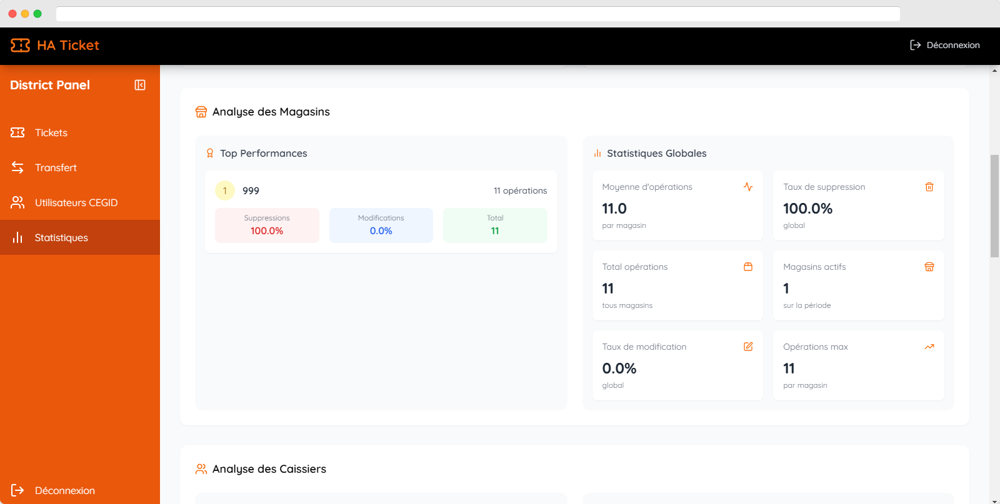  
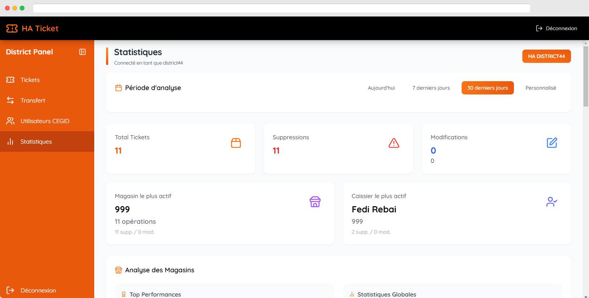  
  
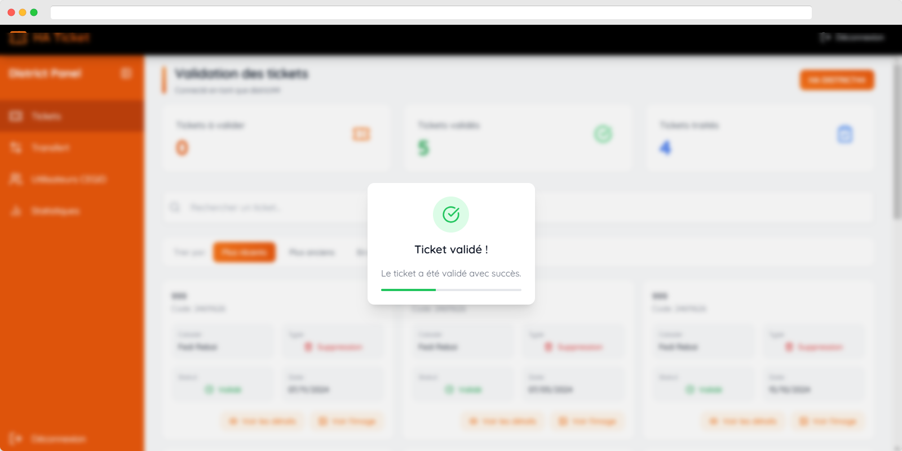  
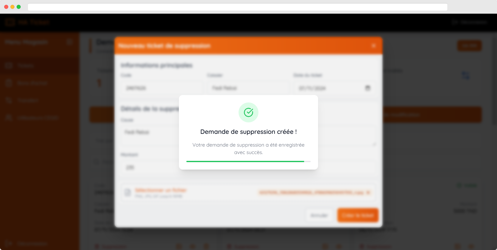  
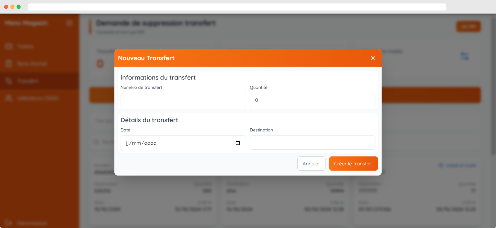  
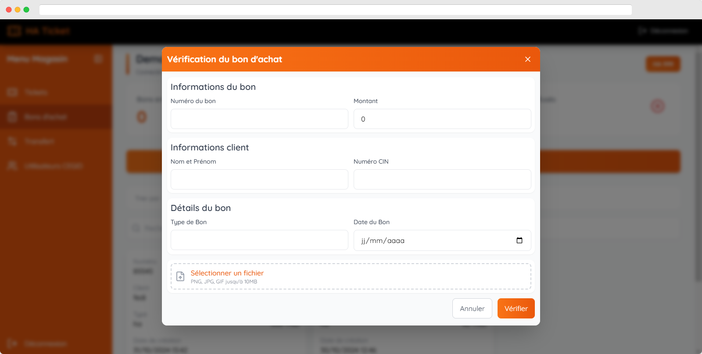  
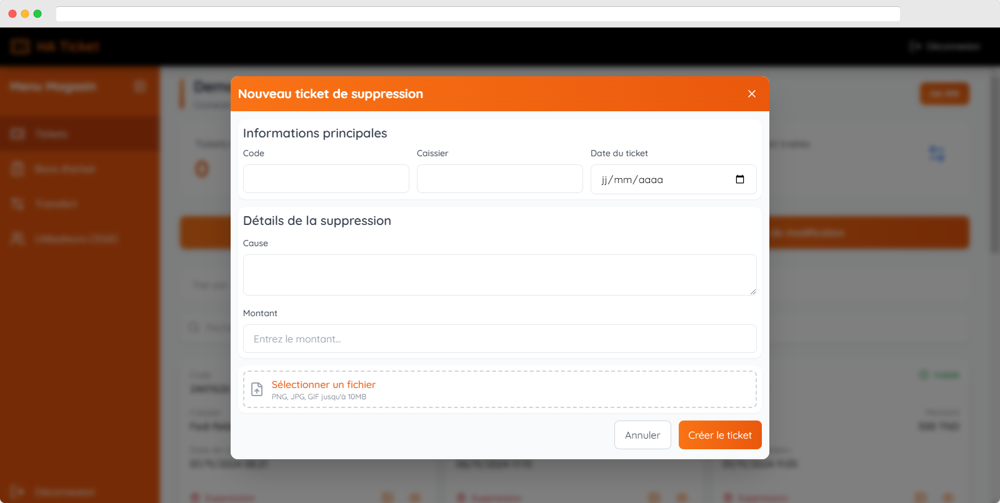  
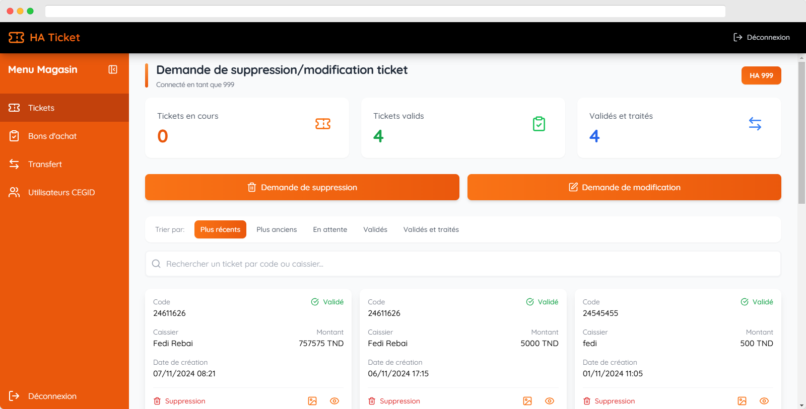  
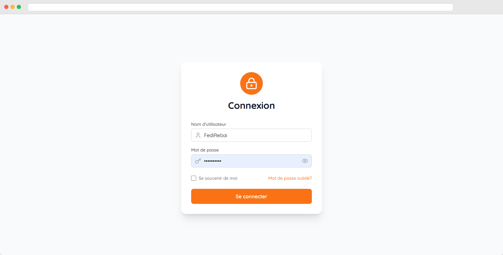  
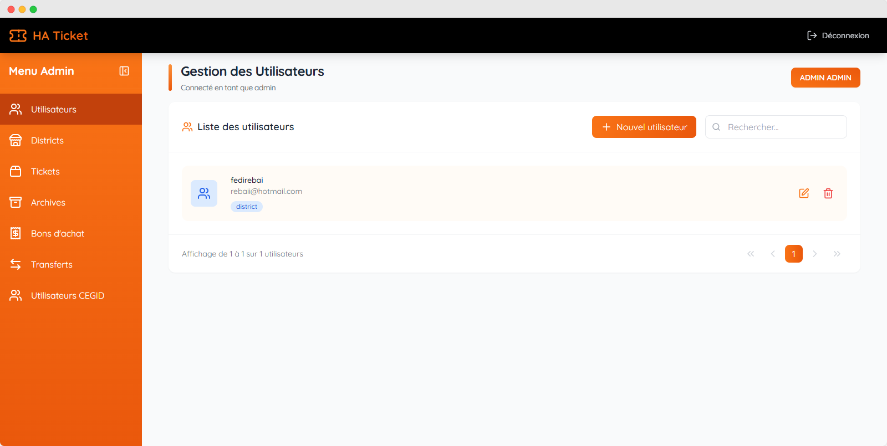  
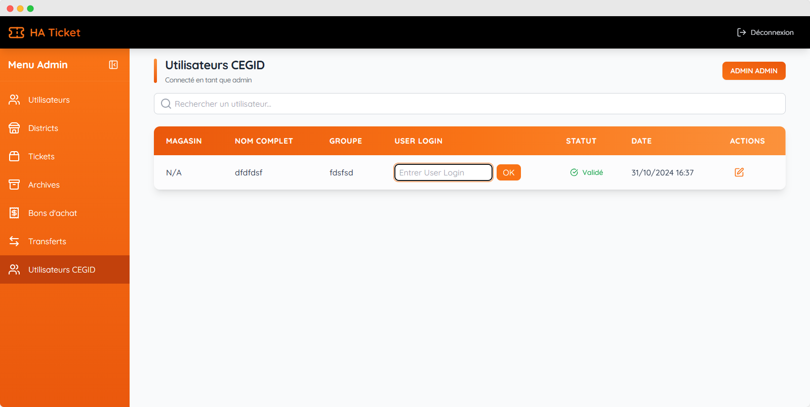  

## 👥 Contribution
Les contributions sont les bienvenues ! N'hésitez pas à ouvrir une issue ou soumettre une pull request.

## 📧 Contact
Rebaii@hotmail.com
